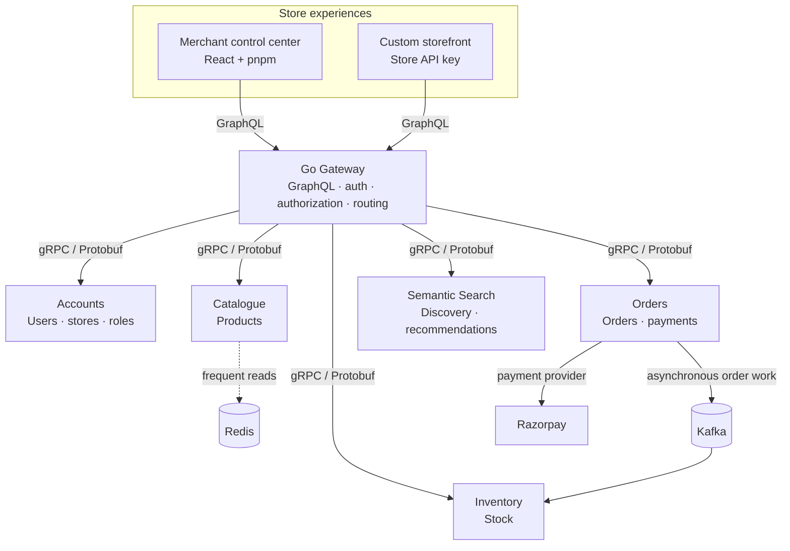

<div align="center">

# SwiftMart

### The commerce platform behind your store.

**Create stores, manage products and stock, process orders, and connect any storefront—with a backend designed around your business.**

<br />


</div>

---

## Commerce operations, connected

An online business quickly grows beyond a product page. Store owners need to manage multiple storefronts, keep stock accurate, process orders and payments, give employees the right access, and make product data available to their own web experiences.

SwiftMart brings those responsibilities together in a multi-tenant platform. Merchants use a React control center, while developers can connect a custom storefront to the GraphQL API. The platform is organized as domain-focused services, each responsible for its own data and business rules.

> **The goal:** let businesses focus on selling instead of assembling and maintaining a separate commerce backend.

## At a glance

| For merchants                                                        | For storefront developers                                      | For the platform                                                                    |
| -------------------------------------------------------------------- | -------------------------------------------------------------- | ----------------------------------------------------------------------------------- |
| Manage multiple stores, products, inventory, orders, and team access | Connect a custom storefront through GraphQL and store API keys | Domain-owned services, gRPC contracts, Kafka workflows, and Redis read optimization |

## What SwiftMart is designed to do

- **Run multiple stores:** manage separate business storefronts from one platform account.
- **Publish and manage products:** keep catalogue data in a dedicated service.
- **Control inventory:** manage stock through its owning service, with order processing designed to reduce overselling.
- **Delegate safely:** assign store users configurable roles and permissions.
- **Accept payments:** integrate Razorpay into the order workflow, with Resilience4j circuit breakers around relevant payment calls.
- **Build a custom storefront:** use the GraphQL API and store API keys to connect an independent frontend.
- **Find products naturally:** provide a foundation for semantic product search and recommendations.

**Project status:** these are capabilities and design goals from the supplied project description. Check [`phases.md`](phases.md) and the source code for current implementation status; this README does not claim that every capability is complete or production-ready.

## How it fits together



The diagram shows the intended boundaries and flow. Exact RPCs, event guarantees, persistence technologies, and runtime wiring should be confirmed in the implementation.

### Service ownership

| Module                                                  | Stack in the project design            | Owns or handles                                                                    |
| ------------------------------------------------------- | -------------------------------------- | ---------------------------------------------------------------------------------- |
| [`/services/gateway`](services/gateway)                 | Go                                     | GraphQL entry point, authentication/authorization boundary, and downstream routing |
| [`/services/accounts`](services/accounts)               | Java · Spring Boot WebFlux             | Users, stores, roles, and permissions                                              |
| [`/services/catalogue`](services/catalogue)             | Go                                     | Product catalogue                                                                  |
| [`/services/inventory`](services/inventory)             | Java · Spring Boot                     | Stock management and mutations                                                     |
| [`/services/orders`](services/orders)                   | Java · Spring Boot                     | Orders and payment workflow                                                        |
| [`/services/semantic-search`](services/semantic-search) | Java · Spring Boot                     | Semantic search and recommendation workflows                                       |
| [`/web`](web)                                           | React · pnpm                           | Merchant control center                                                            |
| [`/proto`](proto)                                       | Protocol Buffers · Buf                 | Shared internal service contracts and code generation workflow                     |
| [`/infrastructure`](infrastructure)                     | Docker · Kubernetes · ArgoCD direction | Local and deployment infrastructure                                                |

All backend services are under `/services`. The React/pnpm web application is at `/web` from the repository root.

## A request, end to end

1. A merchant opens the control center, or a shopper visits a custom storefront.
2. The client sends a GraphQL operation to the gateway. User or store integration identity and authorization determine which data can be accessed.
3. The gateway calls the service that owns the requested domain over gRPC using Protobuf contracts. Frequent catalogue reads may be served through Redis.
4. For an order, the order workflow sends asynchronous stock-related work through Kafka. The inventory service applies stock mutations under its ownership.
5. The order workflow communicates with Razorpay. Circuit breakers are intended to reduce repeated calls when payment operations fail or become slow.
6. The gateway returns the result to the client through GraphQL.

This describes the intended high-level flow. Authentication mechanics, transaction boundaries, event ordering, and exact API fields are implementation details.

## Engineering choices

### Services own their domains

Accounts, catalogue, inventory, orders, and search are separated by business responsibility. Each service is the authority for its own data; cross-service work should go through defined contracts rather than reaching into another service's database.

### GraphQL at the edge, gRPC between services

GraphQL gives web clients a flexible API surface. Internal calls use gRPC and Protocol Buffers to make service contracts explicit and typed.

### Kafka for asynchronous order work

Kafka decouples order intake from stock-changing work and provides a basis for ordered processing. Avoiding overselling also requires inventory-side atomic stock checks, suitable event partitioning, idempotent consumers, and careful retry behavior; Kafka alone does not guarantee it.

### Resilience around payment dependencies

Razorpay is an external dependency. Resilience4j circuit breakers can stop excess calls when configured failure or slow-call thresholds are reached. Payment and order state still need to handle timeouts, retries, and uncertain outcomes safely.

### Redis for frequently read catalogue data

Redis is intended to reduce repeat reads. The catalogue service remains the source of truth, and a production implementation needs clear cache invalidation and tenant-aware keys.

## Local development

The project brief identifies Docker Compose as the local run path. The materials supplied for this README do not establish the Compose filename, service names, ports, health endpoints, or required configuration keys. Use the commands below when a Compose file is present, and confirm project-specific settings in that file and the service documentation.

### You’ll need

- Git
- Docker Engine or Docker Desktop with Docker Compose
- Provider credentials only if you enable integrations such as Razorpay

### Clone and start

```bash
git clone <repository-url>
cd <repository-directory>
```

Check the repository root for `compose.yaml`, `compose.yml`, `docker-compose.yaml`, or `docker-compose.yml`. Review the Compose file and its referenced configuration before starting the stack. If the repository supplies `.env.example` and expects `.env`, copy it and fill in only the documented values:

```bash
# Optional: only if .env.example exists and the project expects .env
cp .env.example .env

docker compose config
docker compose build
docker compose up -d
```

For a Compose file stored at another path, pass its actual path using `-f <compose-file>`. Do not guess configuration keys or put real credentials in source control.

### Check services and find the URLs

```bash
docker compose ps
docker compose logs -f
docker compose logs -f <service-name>
```

`docker compose ps` shows service state and any published ports. Open the web and GraphQL/API URLs specified by the Compose configuration or gateway documentation; no ports or routes were included in the supplied project details. Follow a service's documented health endpoint where available—container state alone does not confirm application health.

Stop the local stack with:

```bash
docker compose down
```

Local configuration and provider secrets must come from the repository's own setup instructions. Treat Razorpay credentials and store API keys as secrets. Some integrations may require configuration before their workflows can run.

## Reliability and scale, by design

Domain boundaries make it possible to evolve and scale services independently. Asynchronous order work and circuit breakers help isolate slow or failing dependencies. To make those patterns dependable, implementations also need:

- tenant context enforced across API, storage, cache, and event boundaries;
- atomic inventory constraints and idempotent event handling;
- recoverable order and payment state transitions;
- health checks, observability, and operational alerts appropriate to deployment.

These are engineering requirements and considerations—not claims that a specific production deployment or observability stack is already in place.

## Repository layout

```text
.
├── AGENTS.md
├── README.md
├── requirements.md
├── architecture.md
├── rules.md
├── phases.md
├── Makefile
├── proto/
├── services/
│   ├── gateway/
│   ├── accounts/
│   ├── orders/
│   ├── catalogue/
│   ├── inventory/
│   └── semantic-search/
├── web/
└── infrastructure/
```

## Roadmap

The sequence below reflects the intended product direction. Refer to [`phases.md`](phases.md) for implementation status and update it against the actual repository.

1. **Service foundations** — service-owned data and stable Protobuf contracts.
2. **Stores and access** — tenant-aware accounts, multiple stores, roles, and permissions.
3. **Commerce core** — catalogue, inventory, and safe concurrent stock updates.
4. **Order lifecycle** — Kafka-based stock workflows, Razorpay, and payment resilience.
5. **Store experiences** — GraphQL gateway, merchant control center, and API-key integrations.
6. **Discovery and performance** — Redis read optimization and semantic search.
7. **Operations** — local Compose experience and Kubernetes/GitOps deployment direction.

---

<div align="center">

**SwiftMart is built around one idea: commerce should be easier to operate than it is to assemble.**

</div>
